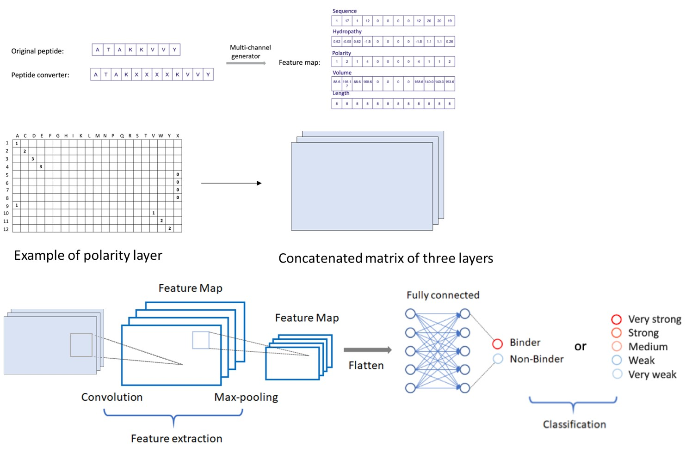

# What is Hyperbinding?

   Hyperbinding is a MHC ligand prediction python package using machine learning approach to generate high-confidence peptides by considering the presentation possibilities of peptides with MHC molecules. MHC-peptide binding prediction plays an important role in cancer immunoengineering, T cell therapy and vaccine design. A simplified immune recognition process invloves the binding of a short peptide with antigen presenting cells, where the peptide comes from cancer neoantigen or virus antigen. Higher binding affinity between MHC and the peptide will allow the MHC-peptide complex to be recognized by T cells and thus elicit immune cascade in eliminating the pathogen.
   
   The current release was trained using only data from HLA-A02:01, which is one of the most abundant alleles in Class I human MHC molecule. Currently, the training and testing support peptides ranging from 8 to 12 amino acids in length, but the model can be re-trained to support more alleles and wider ranges of peptide length.  The further application of Hyperbinding can be extended into different Class I MHC alleles, and broad categories of disease-related peptides.

   
   

# Download and installation

We recommond using Git to install the Hyperbinding.

## Git (All the dependencies should be properly installed)

### System

Linux

### Dependencies   

python    

### Steps

Download the latest version of Hyperbinding from https://github.com/UWDIRECT/HyperBinding
    
    git clone https://github.com/UWDIRECT/HyperBinding.git
    
Unzip the source code and go into the directory by using the following command:

    
 

Invoke the setup script:

    python setup.py install

# General usage

 
WAIT to be completed!!!  
    
    
    
# Application example    

## Prediction of Specific T-Cell Epitopes to Navigate the Immune Response against COVID-19

Following CDC updates for COVID-19:
https://www.cdc.gov/coronavirus/2019-ncov/cases-updates/summary.html

   
   

Updated on Mar.15 2020, CDC is responding to an outbreak of respiratory disease caused by a novel coronavirus which has now been detected in more than 100 locations internationally, including in the United States. The virus has been named “SARS-CoV-2” and the disease it causes has been named “coronavirus disease 2019” (abbreviated “COVID-19”). 

William is an Bioengineer working on T cell engineering and immunotherapy. His lab is supporting the research on COVID-19 by designing high-throughput capture reagents to select and isolate T cells with potent immunity in recognizing and eliminating the virus. Then the isolated T cells will be sequenced and amplified to be transfered back to patients to boost the immune system against the virus. 

The prediction of peptide-MHC binding affinity has rapidly accelerating the development of vaccines and adoptive T-cell therapies targeting virus. To design the high-throughput capture reagents, Rick need a list of peptides:
1.  These peptides are 8 mers from the Surface Spike Glycoprotein (S protein) of SARS-CoV-2 virus
2.  The patient is HLA-A02:01 positive (indicating the type of MHC molecule) so these peptides should have higher binding affinity with HLA-A02:01.

Without overwhelming by complicated installation and coding, HyperBindng is an accessible tool to help Rick in generating the list of potent binders of HLA-A02:01. William has the protein sequence of SARS-CoV-2 virus, which is made up of 1272 amino acids. Now he can following these instructions to slice the protein sequence into fragments with desirable length and predicate their binding ability to HLA-A02:01.

    cd HyperBinding/examples/prediction/
    jupyter notebook main_binding_predictor.ipynb 

## Input files

Hyperbinding takes text input of the peptide sequence.   
For example:
Spike Glycoprotein Sequence of SARS-CoV-2
    
    MFVFLVLLPLVSSQCVNLTTRTQLPPAYTNSFTRGVYYPDKVFRSSVLHSTQDLFLPFFSNVTWFHAIHVSGTNGTKRFDNPVLPFNDGVYFASTEKSNIIRGWIFGTTLDSKTQSLLIVNNATNVVIKVCEFQFCNDPFLGVYYHKNNKSWMESEFRVYSSANNCTFEYVSQPFLMDLEGKQGNFKNLREFVFKNIDGYFKIYSKHTPINLVRDLPQGFSALEPLVDLPIGINITRFQTLLALHRSYLTPGDSSSGWTAGAAAYYVGYLQPRTFLLKYNENGTITDAVDCALDPLSETKCTLKSFTVEKGIYQTSNFRVQPTESIVRFPNITNLCPFGEVFNATRFASVYAWNRKRISNCVADYSVLYNSASFSTFKCYGVSPTKLNDLCFTNVYADSFVIRGDEVRQIAPGQTGKIADYNYKLPDDFTGCVIAWNSNNLDSKVGGNYNYLYRLFRKSNLKPFERDISTEIYQAGSTPCNGVEGFNCYFPLQSYGFQPTNGVGYQPYRVVVLSFELLHAPATVCGPKKSTNLVKNKCVNFNFNGLTGTGVLTESNKKFLPFQQFGRDIADTTDAVRDPQTLEILDITPCSFGGVSVITPGTNTSNQVAVLYQDVNCTEVPVAIHADQLTPTWRVYSTGSNVFQTRAGCLIGAEHVNNSYECDIPIGAGICASYQTQTNSPRRARSVASQSIIAYTMSLGAENSVAYSNNSIAIPTNFTISVTTEILPVSMTKTSVDCTMYICGDSTECSNLLLQYGSFCTQLNRALTGIAVEQDKNTQEVFAQVKQIYKTPPIKDFGGFNFSQILPDPSKPSKRSFIEDLLFNKVTLADAGFIKQYGDCLGDIAARDLICAQKFNGLTVLPPLLTDEMIAQYTSALLAGTITSGWTFGAGAALQIPFAMQMAYRFNGIGVTQNVLYENQKLIANQFNSAIGKIQDSLSSTASALGKLQDVVNQNAQALNTLVKQLSSNFGAISSVLNDILSRLDKVEAEVQIDRLITGRLQSLQTYVTQQLIRAAEIRASANLAATKMSECVLGQSKRVDFCGKGYHLMSFPQSAPHGVVFLHVTYVPAQEKNFTTAPAICHDGKAHFPREGVFVSNGTHWFVTQRNFYEPQIITTDNTFVSGNCDVVIGIVNNTVYDPLQPELDSFKEELDKYFKNHTSPDVDLGDISGINASVVNIQKEIDRLNEVAKNLNESLIDLQELGKYEQYIKWPWYIWLGFIAGLIAIVMVTIMLCCMTSCCSCLKGCCSCGSCCKFDEDDSEPVLKGVKLHYT

Then William can follow the code to select 8 mers with 'Very strong' binding affinity to HLA-A02:01. 

 

